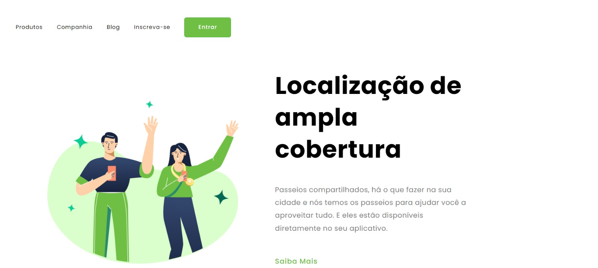
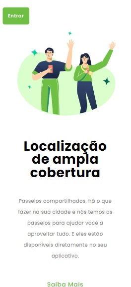
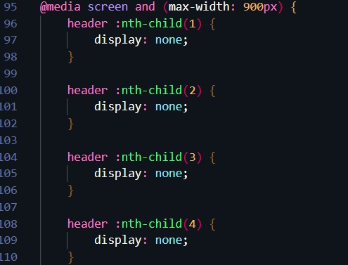
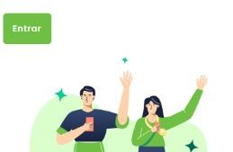

<h1>Projeto Responsivo "Ampla Cobertura"</h1> 
 
 
<h2>Um dos primeiros projetos utilizando as seguintes tecnologias:    </h2>

 
<h3>Exemplo na tela do Destkop 💻:</h3>

 
<h3>Exemplo na tela do Celular 📱</h3>

 
<h3>Aqui no meu Media queries, resolvi diferenciar um pouco, e optei por utilizar a pseudo-classe CSS ":nth-child()" para desaparecer os botões do meu header, deixando somente o último elemento que seria o botão "ENTRAR"</h3>

